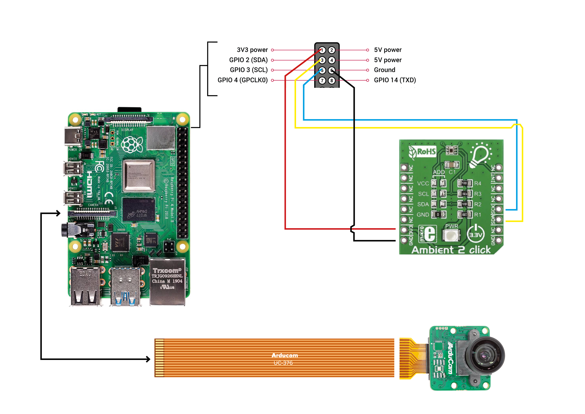

# Camera HDR sensor

:bulb: **This is still in production !!**

This repository enables you to use commonly available modular components to build an HDR image capture device, 
compliant with Radiance software suite. It comprises of hardware and software to go through calibration process and
mount the camera on the ceiling, or anywhere else, like in the field.

## Features
- A low cost way to produce an HDR image remotely, periodically, or in awkward places...
- Takes a series of pictures with varying exposures
- Creates an HDR image using [hdrgen](http://www.anyhere.com/) software
- Via [Radiance](https://www.radiance-online.org/) software, it applies corrections defined during calibration 
proces to end up with a proper final HDR image
- Additionally measures luminosity value with an Ambient2Click sensor, for later validation.

## Table of Contents
1. [Introduction](#introduction)
2. [Bill of Materials (BOM)](#bill-of-materials-bom)
3. [Hardware Setup](#hardware-setup)
4. [Software Setup](#software-setup)
5. [HDR Camera Calibration](#hdr-camera-calibration)
6. [Usage Instructions](#usage-instructions)
7. [Troubleshooting](#troubleshooting)
8. [License](#license)

## Introduction

The device uses a Raspberry Pi 4B with an Arducam fisheye camera in order to produce an HDR image. Additionally, 
an illuminance sensor is attached to record a reading that can be helpful later to validate HDR image. The produced 
HDR image can be later used in light studies, glare analysis etc.

## Bill of Materials (BOM)
| Component                  | Quantity | Description                                                                               | Link                       |
|----------------------------|----------|-------------------------------------------------------------------------------------------|----------------------------|
| Raspberry Pi 4B (or other) | 1        | Small form-factor computer. The design also works with other models.                      | [Example](https://www.raspberrypi.com/products/raspberry-pi-4-model-b/)               |
| Raspberry Pi 4 PoE HAT     | 1        | Add-on to Raspberry Pi enabling power and data input with just one ethernet cable         | [Example](https://www.raspberrypi.com/products/poe-plus-hat/)               |
| Raspberry Pi Camera        | 1        | 180° fisheye camera for Raspberry Pi, Arducam Mini imx477 with 180° LN031 fisheye lens    | [Example](https://www.arducam.com/product/arducam-12mp-imx477-mini-high-quality-camera-module-for-raspberry-pi/) |
| Ambient 2 Click sensor     | 1        | MikroElektronika Ambient 2 Click Light Sensor mikroBus Click Board                        | [Example](https://nl.rs-online.com/web/p/sensor-development-tools/1360740)            |
| Ethernet cable             | 1        | Ethernet cable for connection, lenght as needed                                           | [Example](https://www.allekabels.nl/utp-kabel/7390/1098220/uutp-kabel-cat-5e.html)    |
| 3D printed parts           | 1        | High quality, preferably stereolitography polyjet, resin or similar, pla will not cut it  | [CAD Files](src/hardware) |
| Quick Release Rotating Head| 1        | Standard Camera equipment quick release rotating head, preferably with a level meter      | [Example](https://www.kamera-express.nl/b-i-g-qr-60p-panorama-snelkoppeling-60mm)     |
| Laser-cut MDF parts        | 1        | Optional laser cut elements. 3mm MDF or other hard sturdy material.                       | [CAD Files](src/hardware) |
| Miscellaneous hardware     |          | M3 Screws, bolts, and nuts; wires, Rpi camera cable, etc.                                 | Depends on your location  |

## Hardware Setup

0. **3D Printing of parts:**
	- To save time and money, you can produce all the parts at once. You have to do it first anyway.
	- Before doing that, please go through the whole documentation first to know what is needed for what. And if you need to do any adjustments in the CAD files.
	- With the camera ring hold and the lux sensor bracket you have an option, it can be either 3D-printed or laser cut.
	- Parts should be 3D printed in a high quality and sturdy technology, like stereolitogrpahy polyjet or resin.
	- You will find all the files in the [hardware folder](src/hardware)
1. **Main Camera Hold:**
	- Camera is being held by a base circular piece in all circumstances.
	- You can refer to the [Main Camera Hold Assembly Guide](docs/00_Camera_Hold_Assembly.md).
1. **Calibration Stand Setup:**
	- You may start with calibrating the cmaera first, thus better start with asembling the calibration stand.
	- Follow the [calibration stand assembly guide](docs/01_Camera_Calibration_Assembly.md).
2. **Final Camera Mount:**
	- After the camera is calibrated and all of the correction parameters are defined, you are ready to put your device 
	in place.
	- The final mounting place highly depends on your circumstances, but the use of commonly available camera equippment 
	makes it easy to adjust.
	- Follow the [final mount assembly guide](docs/02_Camera_Final_Assembly.md).
3. **Wiring Diagram:**
	- In all steps, the wiring stays the same. Refer to the [Wiring Diagram](docs/images/Camera_Wiring_Diagram.png)
	- 

## Software Setup

Before anything, you also have to set up the software needed for everything to run properly.

The software stack that we use is based on the [piHDR](https://github.com/andyrew/piHDR) repository and scripts.

Basic software like [picamera2](https://pypi.org/project/picamera2/) library should be installed automatically 
on your Raspberry Pi, but other things like [Radiance](https://www.radiance-online.org/) is quite tricky to install 
on a Raspberyy Pi and looks like rarely anyone is actually doing it. 
But we do!

1. **Installation - Dependencies:**
	- Python - comes by default on the Raspberry Pi Bookworm OS
	- [picamera2](https://github.com/raspberrypi/picamera2) library - should also come by default.
	- [hdrgen](http://www.anyhere.com/) - download the image builder for Raspberry Pi. Or alternatively run:
	 ```bash
	 wget http://www.anyhere.com/gward/pickup/hdrgen_AMDRaspian.tar.gz
	 tar -xf hdrgen_AMDRaspian.tar.gz
	 sudo mv hdrgen /usr/local/bin/.
	 sudo mv hdrcvt /usr/local/bin/.
	 ```
	- imagemagick:
	 ```bash
	 sudo apt-get install imagemagick
	 ```
2. **Enable the Camera Module:**
	- Make sure yuur camrea is connected and works properly.
	- Check the [camera dcumentation](https://www.raspberrypi.com/documentation/computers/camera_software.html)
	- Or alternatively the simple [starters guide](https://projects.raspberrypi.org/en/projects/getting-started-with-picamera/0)
3. **Install and Compile Radiance:**
	- Compiling Radiance on Raspberry Pi can be challanging, especially on newer OS like Bookworm.
	- Refer to the [Radiance Compile Guide](docs/03_Camera_Software_Radiance_Compile.md) to get instructions on 
	how to do it properly, so every app will work.
4. **First run:**
	- Go to the [Usage Instructions](#usage-instructions) and check if things work.
	- Before [Camera Calibration](#hdr-camera-calibration) process, you can only make a basic HDR image, as you don't 
	have the neccessary parameters for Radiance correction executables.
## HDR Camera calibration

Each camera module and fisheye lens is different, even if they come from the same manufacturer and the same line.

That's why it's important to apply corrections to the HDR image taken based on those discrepencies. Those corrections 
	are applied with various Radiance apps in the main [bash script](src/code/#) in consecutive lines after creating 
	an HDR image.

See the [Calibration Guide](docs/04_Camera_Calibration_Guide.md) for detailed instructions.

## Usage Instructions

- In order to only take multiple exposures (images), you can use the python script `exposurebracket.py`.
	 ```bash
	 python3 exposurebracket.py
	 ```
- To run the whole software, simply run `run_hdrcapture.sh`, which will call all necessary scripts and apps.
	 ```bash
	 bash run_hdrcapture.sh
	 ```
- The script will create a new folder in which everything will be stored.
- It also calls the `lux_sensor.py` script providing it with the timestamp. This stores the lux value from the sensor.
- **Note!** In consecutive lines of the `run_hdrcapture.sh`, after the `hdrgen` is run, you can apply various corrections to 
	the HDR via `ra_xyze, pcompos, pfilt` and `pcomb`. Those require parameters and correction `.cal` files specific 
	to your situation, which have to be defined through the calibration process. 
	Again refer to [HDR Camera Calibration](#hdr-camera-calibration)

## Troubleshooting
- [Common Issues and Solutions](docs/troubleshooting.md)

## Contributing
- [Contribution Guidelines](docs/contributing.md)

## License
This project is licensed under the [MIT License](LICENSE).
