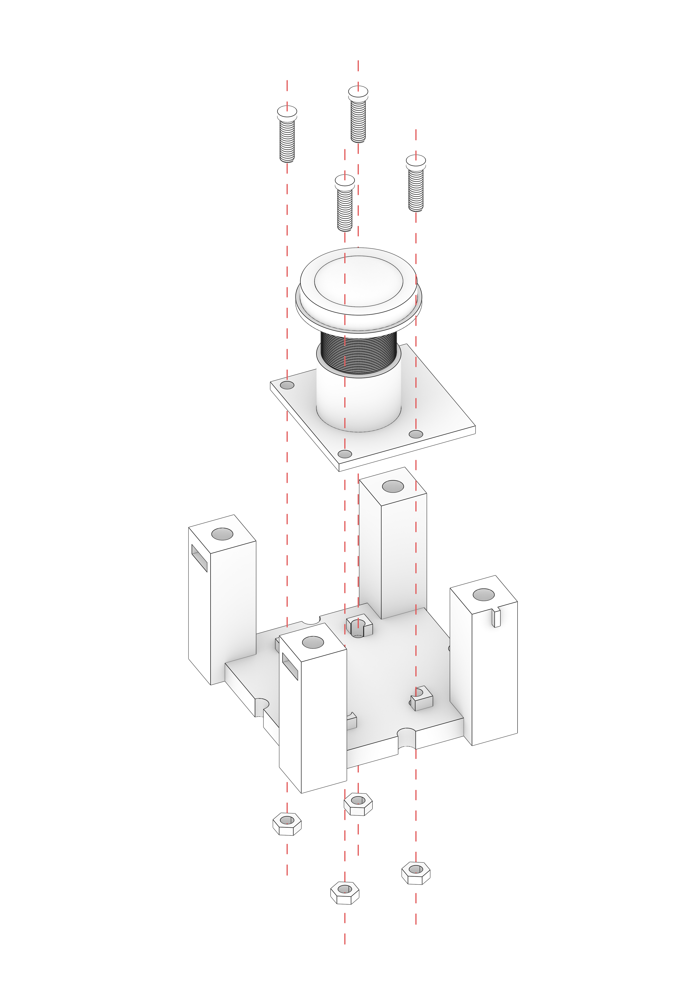
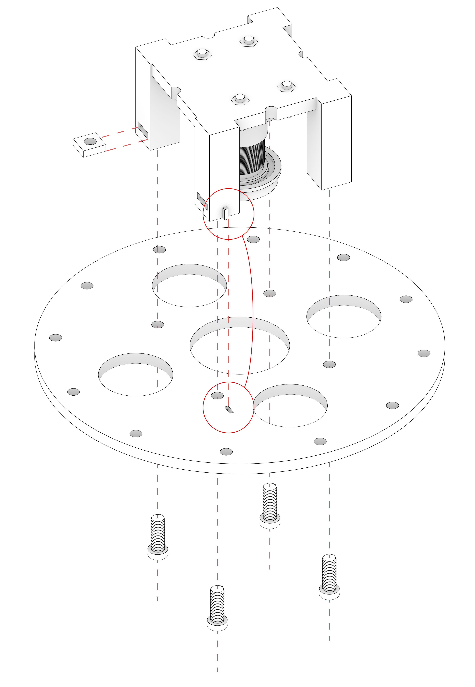
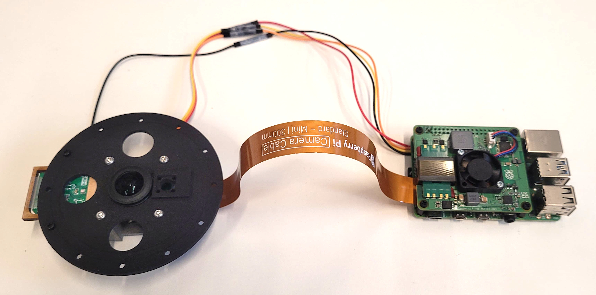

# Camera Hold Assembly Guide

In this quick guide you will see instructions on how to assemble the main circular piece that holds the camera. 
That is used further in calibration and final positioning.

**You will need M3 bolts (9-12mm) and M3 square (5.5x5.5mm) nuts for assembly.**

## Assembly Steps

1. **Produce the pieces:**
	- First you need to produce the pieces:
		- Ring - can be 3D printed or laser cut
		- Spacer - Need to be 3D printed
		- Sensor bracket - can be laser cut or 3D printed
	- The Spacer can be 3D printed using [Camera_RingSpacer](../src/hardware/Camera_RingSpacer.stl) file. [STEP](../src/hardware/Camera_RingSpacer.stp) version is also available.
	- The Ring can be 3D printed using [Camera_Ring](../src/hardware/Camera_Ring.stl) file. [STEP](../src/hardware/Camera_Ring.stp) version is also available.
	- The **Ring** can also be laser cut together with the **Sesnor Bracket** using the [Camera_RingAndSensorBracket](../src/hardware/Camera_RingAndSensorBracket.dwg) file.
2. **Screw the Camera plate to the Ring Spacer:**
	- 
	- Make sure the camera pcp plate is being screwed in the right position, so that it will be centered with the circular piece and the camera hole.
3. **Screw the Spacer to the Ring:**
	- 
	- Note the small notch on one of the Spacer legs, it tells you how to position it relative to the Ring. This notch should match the small mark on the Ring.
	- Put the square nuts in the special cavities in the Spacer legs.

## End Result

It should look like this after the assembly:

