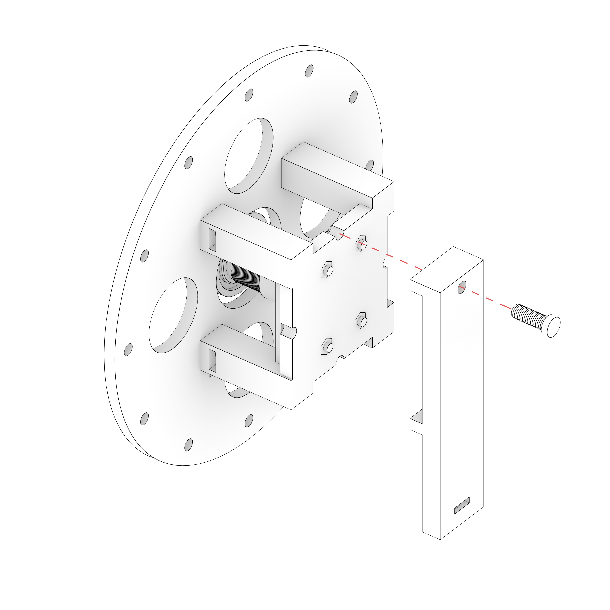
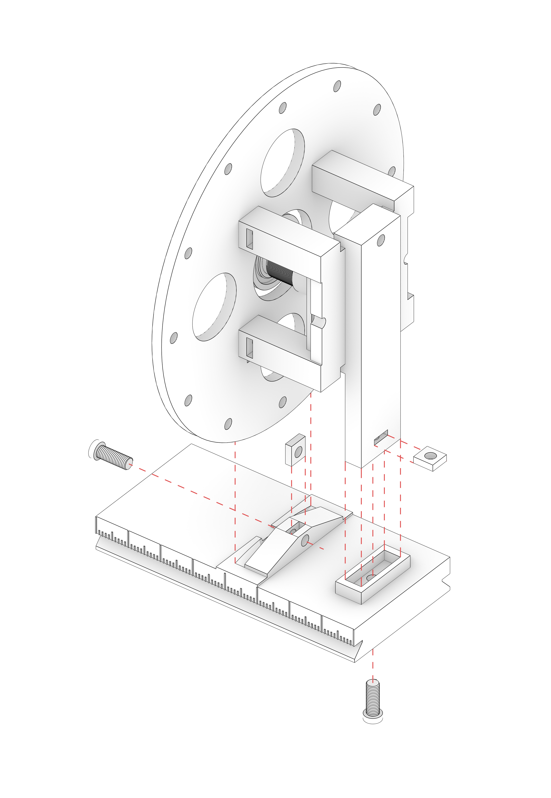
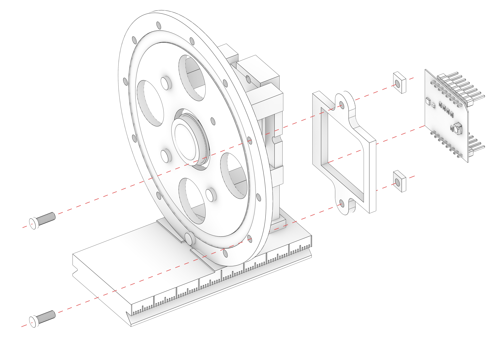

# Camera calibration Stand Assembly Guide

In this guide you will see instructions on how to assemble the Sliding Stand to be used for camera calibration. 
It will be used only during the Calibration process to determine the true paralax point and to keep the Camera still in various positions.

**You will need M3 bolts (9-12mm) and M3 square (5.5x5.5mm) nuts for assembly.**

## Assembly Steps

1. **Produce the pieces:**
	- For Calibration you will need the _Sliding Base_ and the _Vertical Support Stand_ to keep the Camera in place.
	- Both pieces need to be 3D printed:
		- [Camera_Calibration_Slider](..src/hardware/Camera_Calibration_Slider.stl) - [STEP version](..src/hardware/Camera_Calibration_Slider.stp)
		- [Camera_Calibration_VerticalStand](..src/hardware/Camera_Calibration_VerticalStand.stl) - [STEP version](..src/hardware/Camera_Calibration_VerticalStand.stp)
	- You will also need the _Sensor Bracket_ - it can be laser cut using the [Camera_RingAndSensorBracket.dwg](..src/hardware/Camera_RingAndSensorBracket.dwg) file.
2. **Screw the Vertical Stand:**
	- 
	- You can position the Ring how you need.
3. **Screw everything to the Slider:**
	- 
	- Put the bolt square nut in the cavity inside the Vertical stand and the Slider.
	- Use the bolts to secure everything in place.
4. **Attach the sensor:**
	- .
	- Attach the bracket for the _Ambient2Click_ lux Sensor to the Camera Ring. You can use any of the bolt holes on the edges, however it is convenient in your situation.
	- Put the Sensor itself in the bracket and secure it with a tape, or simply glue it with a hot glue gun.
	- Put a milky white tape on the hole in the Ring where the senor is facing out - it's to even out the light coming in.
	- The Sensor should be calibrated the same way as we did with other sensors for the Cube. Refer to [The Cube Guide](../Cube/README.md).
5. **Mount on a rotating head:**
	- You can now mount it on a quick release rotating head or something similar, to be further used during calibration.
	- In our case, the true pralax point of the fisheye camera was at 1mm forward mark from the center of the Slider. So the Camera had to be slided 1mm backwards.

## End Result

It should look like this after the assembly:

