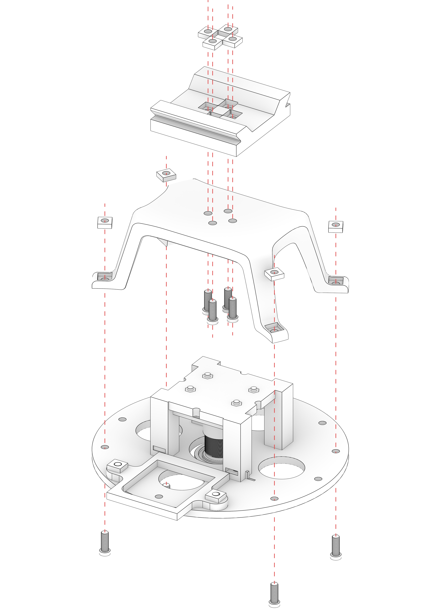

# Camera calibration Stand Assembly Guide

Here you will find instructions on how to assemble the final mounting equipment for the Camera.
You can then use it as you wish depending on where you want the camera to be positioned.

**You will need M3 bolts (9-12mm) and M3 square (5.5x5.5mm) nuts for assembly.**

## Assembly Steps

1. **Produce the pieces:**
	- Here you will need the _Claw_ that holds the Camera ring and the _Slider_ which can be mounted on the Quick Release Head.
	- Both parts need to be 3D printed on high quality:
		- [Camera_Mount_Claw](../src/hardware/Camera_Mount_Claw.stl). - [STEP version](../src/hardware/Camera_Mount_Claw.stp).
		- [Camera_Mount_Slider](../src/hardware/Camera_Mount_Slider.stl). - [STEP version](../src/hardware/Camera_Mount_Slider.stp).
2. **Assemble parts:**
	- .
	- You first need to put bolts into the Claw and attach it to the Slider. It can be attached in different positions thanks to 4 symetrical holes.
	- Then you can attach the Claw to the Ring holding the Camera.
	- The Slider can be put in a quick release clamp, which then can be attached to a tripod or regulated arm.

## End Result

It should look like this after the assembly:

