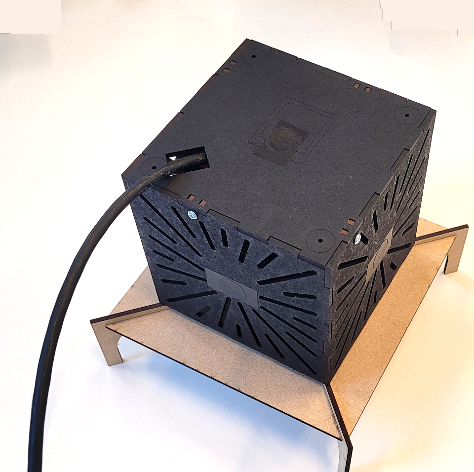

# Cubic Illuminance Sensor

An open-source cubic illuminance meter designed for environmental monitoring. The device uses a Raspberry Pi Zero with "Ambient 2 Click" sensors connected via a multiplexer, all enclosed in a laser-cut box.

## Features
- Measures ambient light in multiple directions (cubic configuration).
- Customizable design using off-the-shelf components.
- Built with open-source hardware and software principles.

## Table of Contents
1. [Introduction](#introduction)
2. [Bill of Materials (BOM)](#bill-of-materials-bom)
3. [Calibration Setup](#calibration-setup)
4. [Final Setup](#final-setup)
5. [Usage Instructions](#usage-instructions)
6. [Troubleshooting](#troubleshooting)
7. [Contributing](#contributing)
8. [License](#license)

## Introduction
The Cubic Illuminance Sensor is designed to measure light levels from different angles for environmental sensing applications. It's based on a Raspberry Pi Zero 2W and 6 "Ambient 2 Click" sensors.

It is assumed that building such a sensor requires previous knowledge and intent on it's purpose. 

However, if you want to learn more, please refer to [the paper](https://journals.sagepub.com/doi/full/10.1177/1477153516631392) on which our design is based on.

## Bill of Materials (BOM)

The bill of materials can also be found in an excel file [Materials_Bill](Materials_Bill.xlsx). Depending on your location there might be different available providers and prices, but we included the ones obtained for our purposes just for reference.

| Component               | Quantity | Description                           | Example Link                       |
|-------------------------|----------|---------------------------------------|----------------------------|
| Raspberry Pi Zero 2W       | 1        | Small form-factor computer            | [Buy here](https://www.raspberrypi.com/products/raspberry-pi-zero-2-w/)               |
| Raspberry Pi Zero 2W PoE HAT | 1 | Add-on to Raspberry Pi enabling power and data input with just one ethernet cable | [Buy here](https://www.kiwi-electronics.com/en/poe-ethernet-usb-hub-hat-for-rpi-zero-10711)
| Raspberry Pi Zero 2W Heatsink | 1 | Add-on for Raspberry Pi to better dissipate heat generated by the chips | [Buy here](https://www.waveshare.com/zero-heatsink.htm) |
| Ambient 2 Click         | 6        | MikroElektronika Ambient 2 Click Light Sensor mikroBus Click Board | [Buy here](https://nl.rs-online.com/web/p/sensor-development-tools/1360740)               |
| Temperature & Humidity Sensor | 1 | Adafruit AHT20 - Temperature & Humidity Sensor Breakout Board | [Buy here](https://www.kiwi-electronics.com/nl/adafruit-aht20-temperature-humidity-sensor-breakout-board-stemma-qt-qwiic-10419) |
| I2C Multiplexer    | 1        | IC TCA9548A I2C Multiplexer - Adafruit 2717 breakout board for sensor connection | [Buy here](https://www.bitsandparts.nl/IC-TCA9548A-I2C-Multiplexer-Adafruit-2717-breakout-board-p113670)  |
| Ethernet cable | 1 | Ethernet cable for connection, length as needed | [Buy here](https://www.allekabels.nl/utp-kabel/7390/1098220/uutp-kabel-cat-5e.html) |
| Laser-cut MDF case  | 1        | The laser cut elements for custom enclosure assembly. 3mm MDF or other hard sturdy material.   | [CAD Files](#)              |
| Miscellaneous hardware  | -        | Screws, spacers, wiring, etc.         | -                           |

## 1. Calibration Setup

First, you have to calibrate the ==Ambient2Click== sensors. Refer to the [Sensors Calibration Guide](docs/01_Calibration.md) for instructions on how to do it.

## 2. Final Cube Assembly and Setup

After the sensors are calibrated, you can proceed to assemble the final cubic enclosure for all components.

Refer to the [Final Production Guide](docs/02_Final_Production_And_Assembly.md) for instructions.

## 3. Software

Software instructions can be found in the [Running Software](docs/03_Running_Software.md) guide.

## Troubleshooting
- [Common Issues and Solutions](docs/04_Cube_TroubleShooting.md)

## License
This project is licensed under the [MIT License](LICENSE).
