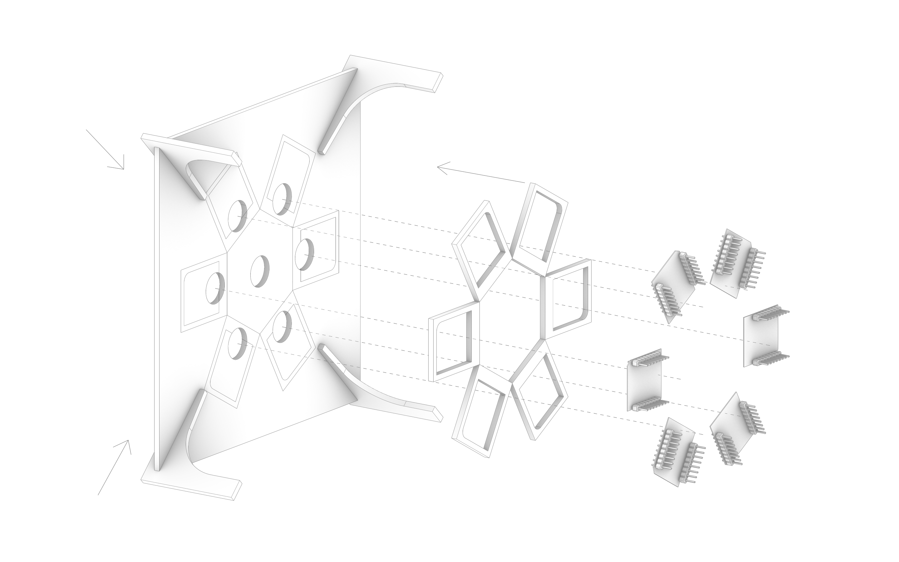
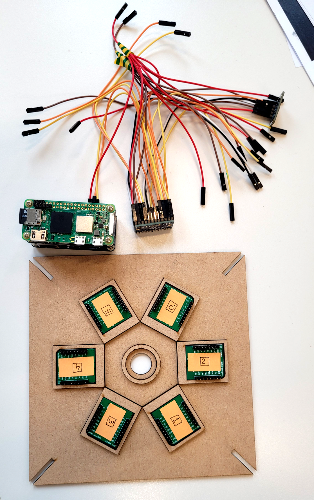
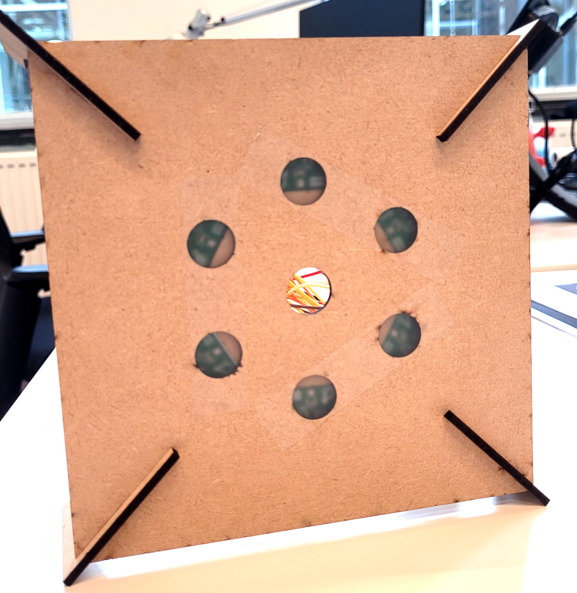
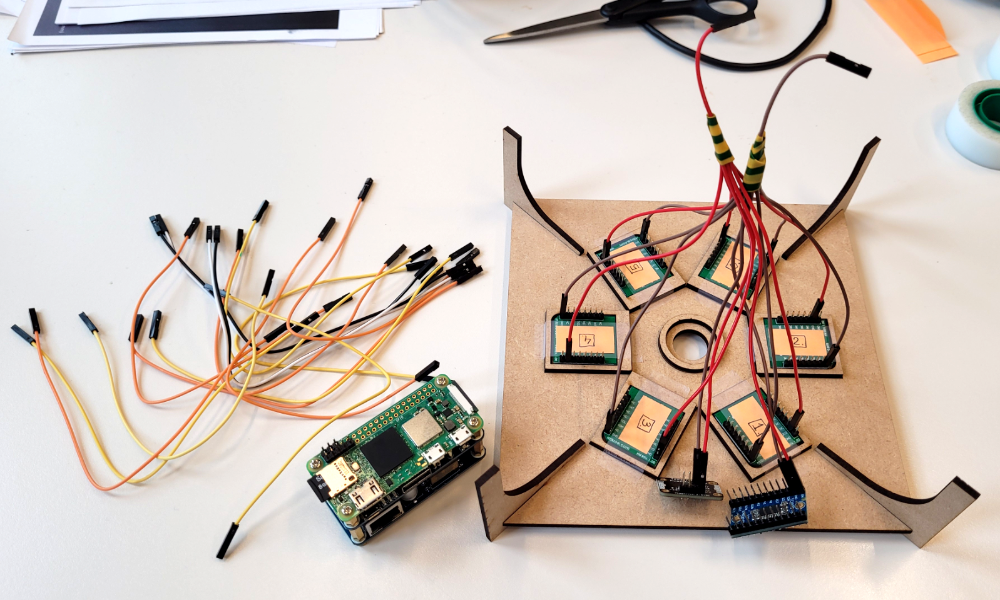
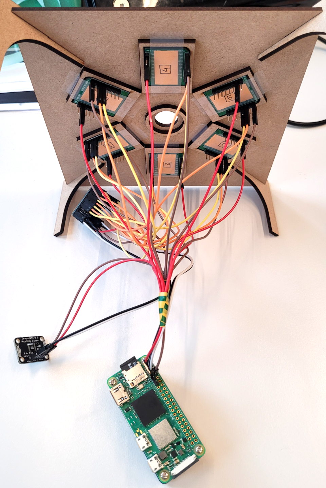
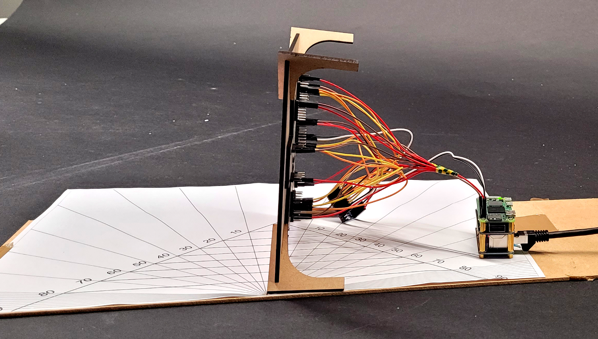
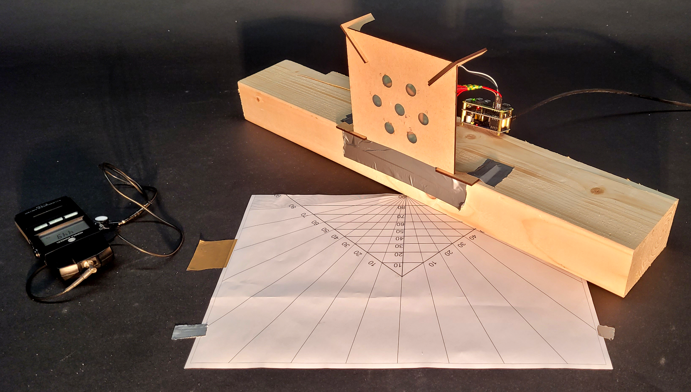

# Cube Device Sensors calibration

For accurate results, before you assemble the final cubic device it is best to calibrate each of the _Ambient2Click_ lux sensors against a research-grade luxmeter.

Here we assume you will have to borrow a professional illuminance meter for the calibration process, like the [Konica Minolta T-10MA](https://www.konicaminolta.eu/eu-en/hardware/measuring-instruments/light-and-display-measurement/illuminance-meters/t-10a-t-10ma) that we used.

The calibration process needs a stable environment and light source. We performed the calibration in two environmental settings:
1. electric light in a dark room
2. room with a single window during a stable overcast day

During calibration, all sensors should be as close as possible to the reference luxmeter. For this purpose, a custom laser cut calibration bench can be fabricated using the provided [CAD files](../src/hardware/Calibration_Bench.dwg) - see explanation below.

## Hardware Assembly - Calibration Setup

1. **Calibration Bench:**
	- You can find the CAD file for the Calibration Bench [here](../src/hardware/Calibration_Bench.dwg)
	- Laser cut and assemble the calibration bench. Refer to the [Instructions](Images/Cube_Calibration_00_Bench_Assembly_Diagram.png) provided. Use glue to stick the sensor brackets to the main board with holes.
	- 
	- Place the sensors in the slots on the back of the bench. Number them so you know which one is which. Use tape to keep them in place.
	- 
	- There is one additional hole in the centre of the bench face - it can be used either to place the reference meter (which we did for our purposes), or an additional sensor to be calibrated.
	- 
	- Use a matte scotch tape to cover the holes through which the sensors look outwards. This is supposed to improve the cosine response of the sensors, although the case geometry is not engineered for this as in professional luxmeters.
2. **Wire:**
   - Connect the "Ambient 2 Click" sensors to the TCA9548A multiplexer
   - The humidity and temperature sensor is not needed in this step, but you can also connect it to the multiplexer
   - Wire the multiplexer to the Raspberry Pi Zero
   - 
   - Follow the [Wiring Diagram](Images/Wiring_Diagram.png)
   - 
   - 
3. **Desk Setup:**
	- Print an angle measuring sheet. This will help you rotate the bench evenly each measurement step
	- The bench centre should also be in the center of rotation

## Software

1. **Installation:**
   - The code is tested and running on a Raspberry Pi Bookworm OS
   - Before anything else, update your Raspberry Pi system and libraries:
     ```bash
     sudo apt-get update
	 sudo apt-get upgrade
     ```
   - All the required python libraries (smbus, time, csv, argparse) should be installed by default on a Raspberry Pi system.
2. **Running the Software:**
   - Execute the python script [sensor_data_collect_store_csv.py](../src/code/sensor_data_collect_store_csv.py) to capture readings directly to a .csv file in the same folder:
     ```bash
     # Run the Python script, passing the CSV file as an argument
	 python3 sensor_data_collect_store_csv.py "CSV_FILE.csv"
     ```
   - Or use the bash script [run_sensor_collector.sh](../src/code/run_sensor_collector.sh), in which you have to specify the destination folder. The script will automatically create a new .csv file named with the current day:
     ```bash
     sudo bash run_sensor_collector.sh
     ```
   - Check if the readings make sense and if everything is stored properly. Refer to [Cube_Troubleshooting](04_Cube_TroubleShooting.md) in case problems arise.
3. **Proceed to Calibration**

## Calibration Steps

1. **Table Setup**
	- Place the light source and the center of the calibration bench on the same height
	- The distance from the light source to the calibration bench should be roughly 5 times the diameter of the light source
	- Place the calibration bench on the angular measure centre, so it rotates on the axis of the center (the centre sensor in the middle of the bench)
	- Start with the bench facing the light source.
	- 
	- Make sure there are no other visible light sources to minimise the measurement interference.
2. **Take a measurement**
 	- Run the [run_sensor_collector.sh](../src/code/run_sensor_collector.sh) bash script, which will create the csv file with measurements. Each time you run the script, new measurements will be added as next rows.
	```bash
	sudo bash run_sensor_collector.sh
	```
 	- As you can see, the measurements are also displayed in the command line, make sure they look correct. For example, it may happen that the first measurement is 0. Then just take another one and it should work properly.
	- Next, take measurements with the reference meter. To be thorough, you should take a measurement for each of the sensors, keeping the measuring piece as close to the sensor, basically covering it. Store the measurements in an excel file together.
	- The basic idea is that you should have stable measurements for each of the sensors - one directly from the sensor, and one from the reference sensor.
4. **Repeat with other angles and environment setting:**
	- 
	- Rotate the calibration bench by 15°.
	- Take and store measurements until you reach the 90° mark.
	- repeat the whole process in a daylight room setting.
5. **Example Calibration csv structure:**

| Angle | Sensor Number (ID) | Sensor Reading |
| ----- | ------------------ | -------------- |
| 0     | Sensor 0           | 500            |
| 0     | Sensor 1           | 532            |
| 0     | Sensor 2           | 498            |
| 0     | Sensor ....        | ---            |
| 0     | Sensor Reference 0 | 512            |
| 0     | Sensor Reference 1 | 543            |

5. **Compare and adjust**
	- Compare readings from sensors with the reference sensor on a graph and calculate the mean bias error across all angles, for each sensor.
	- Apply the adjustments to each sensor to minimize any bias error and hardcode them in the code of the measuring script.
6. **Apply calibration in the code:**
	- Go to the [sensor reading script](../src/code/sensor_data_collect_store_csv.py)
	- Find the `read_lux()` function definition and navigate to the end of it.
	- Here, before the final `lux_corrected` value is returned, you should apply the required modification for correction, based on the calibration performed.

## End
