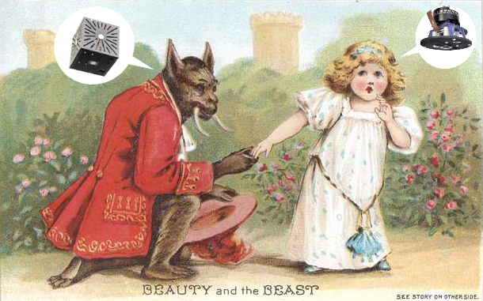

# Acapulco Light Sensors: The Cube and The Camera

## Introduction

The Cube (cubic illuminance sensor) and the Camera (HDR image generation setup) sensors were developed as open hardware devices to support predictive building control as part of the [Acapulco](https://www.thegreenvillage.org/project/acapulco/) research project at the [TU Delft Green village](https://www.thegreenvillage.org/).
The Acapulco project, based in the TU Delft Green Village, The Netherlands, is developing innovative design tools to optimise the sustainability of heating, cooling and lighting systems in commercial buildings. The project focuses on integrating thermal storage, a heat pump with ground and surface water sources, automated outdoor Venetian blinds, daylight-linked lighting controls, and AI-powered predictive controls to enhance energy efficiency, reduce CO2 emissions, and alleviate grid congestion.

## Sensing Devices

The project uses two environmental sensing devices, which are referred to as "sensors" in this documentation. 
Each device is in fact a collection of various sensors and parts.
The two devices are used in combination in the Acapulco project, however, one can be used without the other as they are completely independent in their functions.

In two separate folders you can find all needed instructions to assemble and use the two sensors:
1. [**The Cube**](Cube/)
	- A cubic open-source illuminance sensor designed for environmental monitoring (The Cube).
	- The Cube uses a Raspberry Pi Zero 2W with "Ambient 2 Click" sensors connected via a multiplexer, with additional temperature and humidity sensors, all enclosed in a laser-cut box.
 	- Concept inspired by the work of Xia, L., Pont, S. C., & Heynderickx, I. (2017). *Light diffuseness metric, Part 2: Describing, measuring and visualising the light flow and diffuseness in three-dimensional spaces.* Lighting Research & Technology, 49(4), 428–445. [https://doi.org/10.1177/1477153516631392](https://journals.sagepub.com/doi/10.1177/1477153516631392)
2. [**The Camera**](Camera/)
	 - A camera setup for HDR image generation (The Camera).
	 - The Camera uses a Raspberry Pi 4B, with one additional "Ambient 2 Click" sensor for luminance validation. Attached to the ceiling by 3D-printed parts and standard camera mounting elements.
 	 - Concept inspired by the work of Kruisselbrink, T., Aries, M., & Rosemann, A. (2017). A Practical Device for Measuring the Luminance Distribution. International Journal of Sustainable Lighting, 19(1), 75–90. [https://doi.org/10.26607/ijsl.v19i1.76](https://lightingjournal.org/index.php/path/article/view/76)

## Authors

The sensors design, production, and calibration were performed by:
- [Jan Zawadzki](https://www.linkedin.com/in/jan-zawadzki-a92650213/)
- [Eleonora Brembilla](https://www.tudelft.nl/en/staff/e.brembilla/)
- [Pedro de la Barra Luegmayer](https://www.tudelft.nl/en/staff/p.delabarraluegmayer/)
- [Wouter Beck](https://www.linkedin.com/in/wouterbeck/)

## Acknowledgments 

The development of these sensors was supported by a [Open Hardware Stimulation Fund](https://www.tudelft.nl/open-hardware) from the [TU Delft Open Science Program](https://www.tudelft.nl/en/open-science) and by the RVO MMIP Acapulco project (Grant number TSEGO23017).
